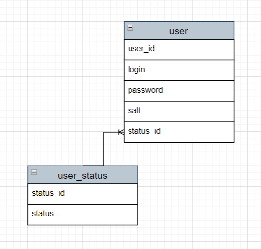
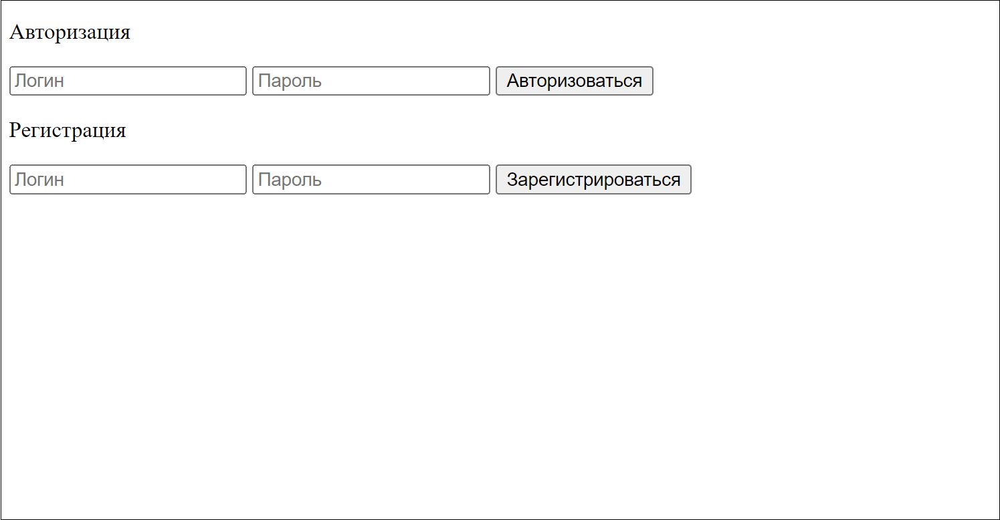
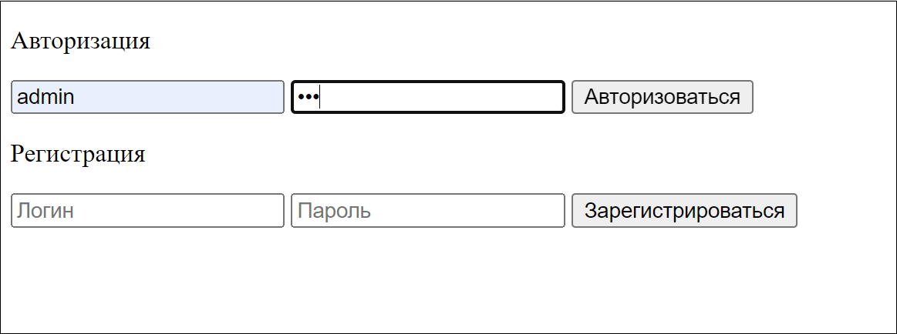
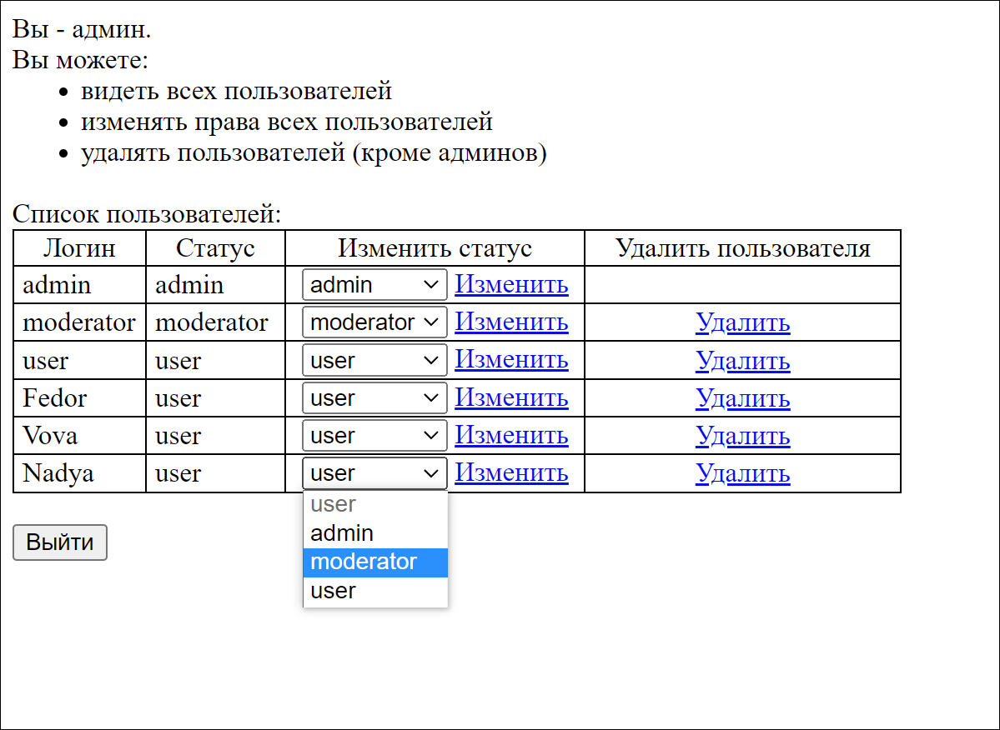
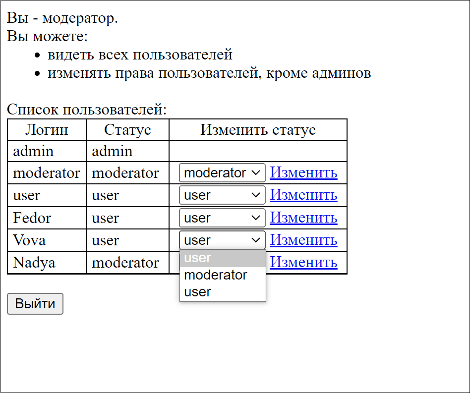
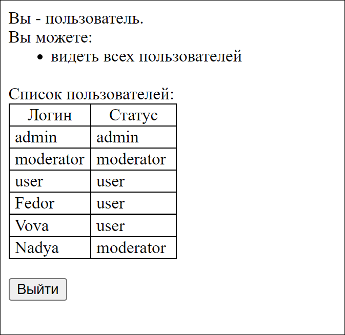
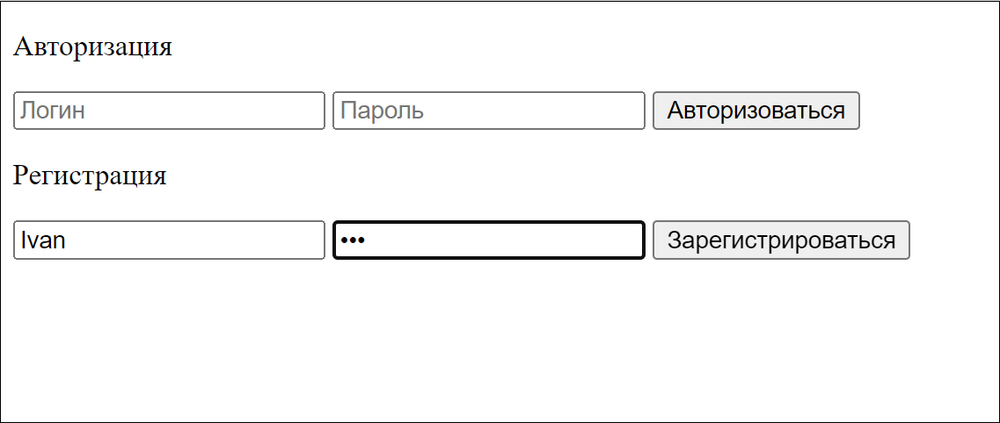
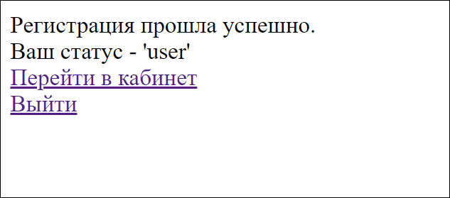
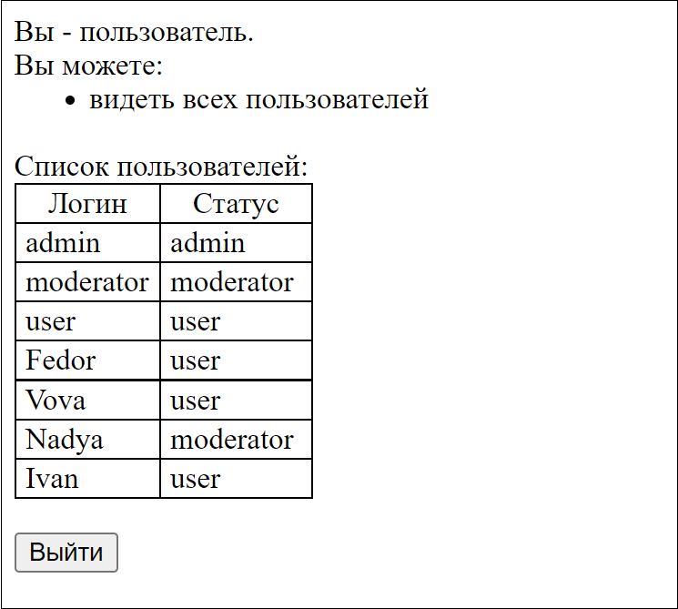
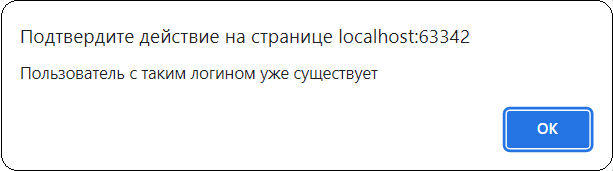

# Service registration and authentication (php)
Сервис регистрации и аутентификации на чистом PHP c базой данных MySQL, шифрованием паролей ('salt' + md5) и разделением прав пользователей.
  

Содержание:
- [структура данных](#structure);
- [пример работы приложения](#example):
    - [авторизация](#auth),
    - [регистрация](#reg).
  

 
## Структура данных.
Структура состоит из двух таблиц: пользователи и статус пользователей.

Пользователи (user):
- id пользователя (user_id),
- логин пользователя (login),
- пароль пользователя (password),
- соль для пароля (salt),
- id статуса пользователя (status_id).

Статус пользователя (user_status):
- id статуса (status_id),
- статус (status).
  

Виды статусов у пользователей:
- администратор (admin),
- модератор (moderator),
- обычный пользователь (user).

Графическое представление структуры данных:

  

## Пример работы приложения.

### **Авторизация:**

1. При открытии главного окна (index.php), попадаем на форму:

    

2. Например, зайдем в роли **администратора**:
- Логин: admin
- Пароль: 123

    

3. При входе в роли администратора попадаем в кабинет, с описанием роли и возможностей:
    *Примечания:*
    - *для изменения статуса пользователя необходимо выбрать новый статус и нажать "Изменить",*
    - *для удаления пользователя из БД - достаточно нажать "Удалить"*.
  

    

    После завершения работы можем нажать "Выйти". Так мы попадем на главную страницу и сессия завершится.

4. Теперь зайдем в роли **модератора**:
- Логин: moderator
- Пароль: 123

    

    Как видим, модератор не может:
    -  удалять пользователей,
    - изменять статус у администраторов, 
    - назначать администраторов.

5. Попробуем зайти в роли обычного пользователя:
- Логин: user
- Пароль: 123

    

    Как видим, пользователь может только просматривать список пользователей.
  

### **Регистрация:**

1. Например, попробуем зарегистрироваться как новый пользователь с логином 'Ivan' и каким-либо паролем:

    

2. После нажатия кнопки "Зарегистрироваться", попадаем на страницу с уведомлением об успешной регистрации:

    

    *При регистрации новому пользователю автоматически присваивается статус "user".*

3. Отсюда мы можем перейти в свой кабинет:

    

4. Если попробуем зарегистрироваться повторно с логином 'Ivan', то программа на выведет следующее сообщение:

    

    *При регистрации и авторизации программа проверяет наличие логина в базе вне зависимости от заглавного или строчного ввода. То есть, логины "Ivan" и "ivan" будут считаться идентичными.*